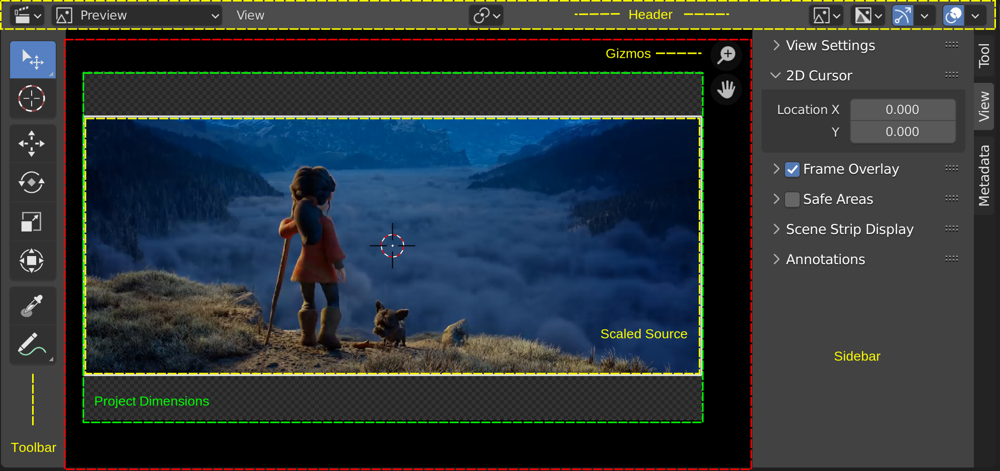

Theeeeeeeeee Preview contains - just as the Sequencer- two areas (see figure 1). The header is shown in a yellow outline with the black Preview window (red outline) underneath. This Preview window has no fixed dimensions; you can zoom in or move indefinitely. However, in figure 1 you see a checkered area (green outline). This area has the size of the Project Dimensions; e.g. 1920 x 1080 pixels in figure 1. But, because the source strip could be scaled in a different resolution, the yellow outline shows the area that the source strip occupies. As you can see, the Open movie “Spring” has a different resolution than the project and letterboxes are added at the top and bottom of the image.

In contrast with the Sequencer example, both the Toolbar and Sidebar are expanded in figure 1. The gizmos however are unique for the Preview.

Sequencer preview is used to display result of rendering Sequencer timeline. This can be further configured to display output from certain channel, overlay or image analyzer (scope). You can adjust the view by zooming in with NumpadPlus and zoom out with NumpadMinus.

